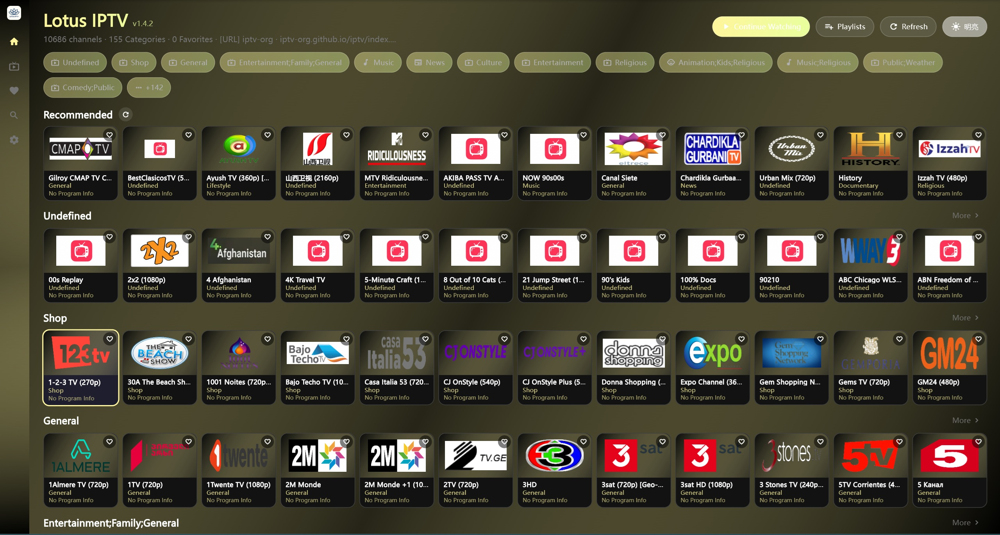
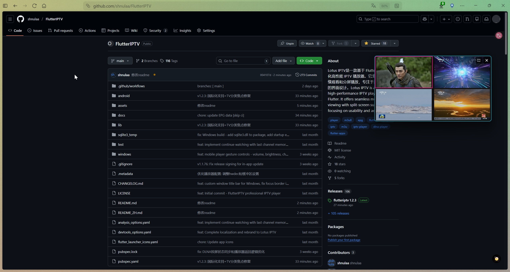

# VoXTv Players

<p align="center">
  
</p>

<p align="center">
  <strong>Reproductor IPTV moderno para Windows, Android y Android TV</strong>
</p>

<p align="center">
  <a href="https://github.com/TonyBlanco/VOXTX-Android/releases">
    
  </a>
  <a href="https://github.com/TonyBlanco/VOXTX-Android/actions/workflows/build-release.yml">
    
  </a>
  <a href="https://github.com/TonyBlanco/VOXTX-Android/releases">
    
  </a>
</p>

<p align="center">
  <strong>Español</strong> | <a href="README_EN.md">English</a>
</p>

VoXTV es un reproductor IPTV moderno y de alto rendimiento desarrollado con Flutter. Incluye una interfaz visual cuidada y está optimizado para escritorio, móvil y TV.

> **💡 Comentarios bienvenidos**  
> Te invitamos a abrir [Issues](https://github.com/TonyBlanco/VOXTX-Android/issues). Tus reportes y sugerencias ayudan directamente a mejorar el proyecto.

## 📸 Capturas de pantalla

<table>
  <tr>
    <td align="center"><br><sub>🏠 Inicio (tema oscuro)</sub></td>
    <td align="center"><br><sub>🏠 Inicio (tema claro)</sub></td>
    <td align="center"><br><sub>📡 Canales</sub></td>
  </tr>
  <tr>
    <td align="center"><br><sub>▶️ Reproductor</sub></td>
    <td align="center"><br><sub>❤️ Favoritos</sub></td>
    <td align="center"><br><sub>⚙️ Ajustes</sub></td>
  </tr>
  <tr>
    <td align="center"><br><sub>📂 Gestor de listas</sub></td>
    <td align="center"><br><sub>📺 Mini pantalla</sub></td>
    <td align="center"><br><sub>📺 Pantalla dividida</sub></td>
  </tr>
</table>

## ⚠️ Aviso legal

1. Esta aplicación se ofrece únicamente como reproductor multimedia y no proporciona, aloja, almacena ni distribuye contenido audiovisual.
2. La aplicación no incluye listas M3U/M3U8 ni fuentes de contenido preconfiguradas.
3. Cada usuario es responsable de asegurarse de que los contenidos y listas que utiliza provienen de fuentes legales y autorizadas.
4. El desarrollador no asume responsabilidad por la legalidad, licencias o derechos de autor del contenido reproducido mediante la app.

## 🚀 Primeros pasos

### 📋 Añadir listas IPTV

Para empezar a ver canales, debes añadir una lista M3U/M3U8/TXT:

**Cómo añadirla:**
1. Abre VoXTV
2. Pulsa "Add Playlist" o el botón "+"
3. Selecciona "From URL"
4. Pega la URL
5. Pulsa "Add" y espera a que carguen los canales

#### 📁 Otras fuentes de lista
- **Archivos locales**: importa archivos `.m3u` o `.m3u8` desde tu dispositivo
- **URLs personalizadas**: añade las URLs de tu servicio IPTV
- **Código QR**: escanea un QR con la URL de la lista

> **Nota**: para una mejor experiencia, utiliza listas de tu proveedor IPTV.

## 🚀 Descarga

Descarga la última versión desde [Releases](https://github.com/TonyBlanco/VOXTX-Android/releases/latest).

### Plataformas disponibles
- **Windows**: instalador x64 (`.exe`)
- **Android móvil**: APK para `arm64-v8a`, `armeabi-v7a`, `x86_64`
- **Android TV**: APK para `arm64-v8a`, `armeabi-v7a`, `x86_64`

## 🎮 Controles

### Escritorio/Móvil

| Acción | Teclado | Ratón/Toque |
|--------|---------|-------------|
| Reproducir/Pausar | Espacio/Enter | Clic |
| Canal anterior | ↑ | Deslizar arriba |
| Canal siguiente | ↓ | Deslizar abajo |
| Abrir panel de categorías | ← | - |
| Cambiar fuente | ←/→ | - |
| Favorito | F | Pulsación larga |
| Silenciar | M | - |
| Salir del reproductor | Doble Esc | - |
| Entrar en multiventana | - | Clic en botón |

### Android TV

| Acción | Botón del mando | Descripción |
|--------|------------------|-------------|
| Reproducir/Pausar | OK (pulsación corta) | Alterna reproducción |
| Canal arriba/abajo | D-Pad Arriba/Abajo | Cambia de canal |
| Abrir panel de categorías | D-Pad Izquierda (pulsación larga) | Muestra categorías |
| Cambiar fuente | D-Pad Izquierda/Derecha | Cambia entre fuentes |
| Favorito | OK (doble clic) | Añadir/quitar favorito |
| Entrar en multiventana | OK (pulsación larga) | Entra en modo 2x2 |
| Salir del reproductor | Atrás (doble pulsación) | Vuelve a la lista de canales |

### Modo multiventana en TV

| Acción | Botón del mando | Descripción |
|--------|------------------|-------------|
| Mover foco | D-Pad | Cambia entre 4 pantallas (también cambia el audio) |
| Seleccionar canal | OK (pulsación corta) | Abre selector de canal para la pantalla enfocada |
| Limpiar pantalla | OK (pulsación larga) | Elimina el canal de la pantalla enfocada |
| Salir de multiventana | Atrás | Vuelve al reproductor simple o sale |

## ✨ Funcionalidades

### 🎨 Sistema de temas multicolor
- **12 esquemas predefinidos**: 6 oscuros + 6 claros
- **Cambio dinámico de tema**: actualiza colores en toda la UI al instante
- **Paletas**: Lotus Pink, Ocean Blue, Forest Green, Sunset Orange, Royal Purple, Cherry Red
- Tarjetas con estilo glassmorphism en escritorio/móvil
- Interfaz optimizada para TV
- Barra lateral con auto-colapso
- Colores aplicados globalmente a selección, botones, iconos y gradientes

### 📺 Soporte multiplataforma
- **Windows**: interfaz optimizada con atajos de teclado y modo mini
- **Android móvil**: interfaz táctil con gestos
- **Android TV**: navegación completa con D-Pad y mando

### ⚡ Reproducción de alto rendimiento
- **Escritorio/Móvil**: `media_kit` con aceleración por hardware
- **Android TV**: ExoPlayer nativo (Media3) con soporte 4K
- Mostrar FPS en tiempo real (configurable)
- Estadísticas de vídeo (resolución, códec)
- Soporte para HLS (m3u8), MP4, MKV, RTMP/RTSP y más

### 📂 Gestión inteligente de listas
- Importación de listas M3U/M3U8/TXT desde URL o archivos locales
- Importación por código QR para transferir fácilmente del móvil a la TV
- Agrupación automática por `group-title`
- Conserva el orden original de categorías en M3U
- Pruebas de disponibilidad de canales por lotes

#### Formatos de lista soportados
- **M3U/M3U8**: formato IPTV estándar con soporte EPG y logos
- **TXT**: formato simplificado usando `,#genre#` como marcador de categoría
  ```
  Nombre de categoría,#genre#
  Nombre del canal,URL del canal
  Nombre del canal,URL del canal
  ```

### ❤️ Funciones para el usuario
- Gestión de favoritos con pulsación larga
- Búsqueda de canales por nombre o grupo
- Panel de categorías dentro del reproductor (tecla IZQUIERDA)
- Doble pulsación de ATRÁS para salir (evita salidas accidentales)
- Historial de reproducción
- **Auto Channel Logo Matching**: más de 1088 logos integrados con coincidencia difusa
  - Mostrar logo automáticamente para listas TXT sin logo
  - Prioridad en 3 niveles: logo M3U → logo en base de datos → imagen por defecto
- **Auto-play al iniciar**: opción para continuar reproducción al abrir la app
- **Multi-fuente**: combina canales con el mismo nombre y permite cambiar fuente con IZQUIERDA/DERECHA
- **Multiventana** (Escritorio y TV): modo 2x2 con 4 canales simultáneos, EPG independiente y modo mini en escritorio

### 📡 EPG (Guía Electrónica de Programación)
- Soporte para XMLTV
- Carga automática desde `x-tvg-url` en M3U
- Configuración manual de URL EPG en ajustes
- Muestra programa actual y siguientes en el reproductor
- Indicador de tiempo restante del programa

### 📺 Casting DLNA
- Servicio DLNA renderer (DMR) integrado
- Envía vídeo desde otros dispositivos a VoXTV
- Soporte para formatos de vídeo comunes
- Control de reproducción desde el dispositivo emisor (play/pause/seek/volumen)
- Opción de inicio automático del servicio DLNA

## 🛠️ Desarrollo

### Requisitos
- Flutter SDK (`>=3.5.0`)
- Android Studio (Android/TV)
- Visual Studio (Windows)

### Compilación
```bash
git clone https://github.com/TonyBlanco/VOXTX-Android.git
cd VOXTX-Android
flutter pub get

# Ejecutar
flutter run -d windows
flutter run -d <android_device>

# Build release
flutter build windows
flutter build apk --release
```

## 🤝 Contribuciones

Se aceptan pull requests.

## 📄 Licencia

Este proyecto está bajo licencia MIT.
