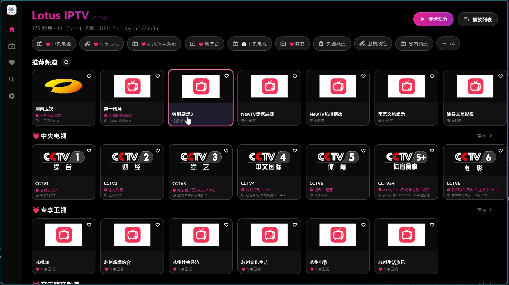
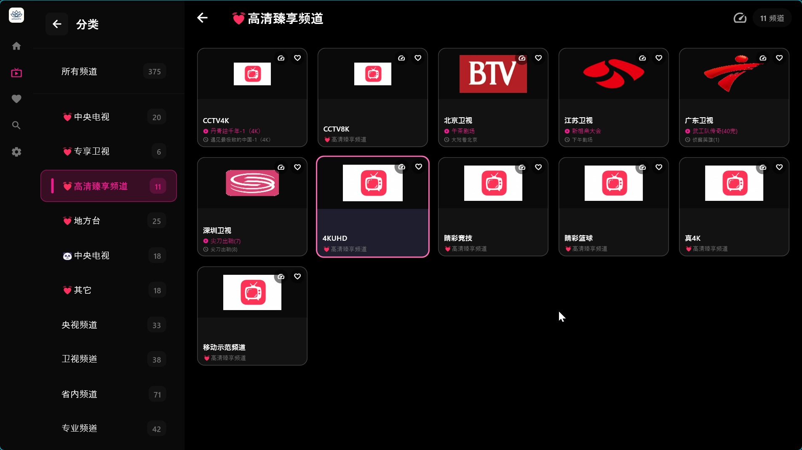

# Lotus IPTV (中文说明)

[English](README.md) | **中文**

Lotus IPTV 是一款基于 Flutter 开发的现代化高性能 IPTV 播放器。它支持多平台无缝观看，专注于易用性和美观的界面设计。

## 📸 软件截图

<p align="center">
  
  
  
</p>

## ✨ 功能特性

- **📺 卓越的跨平台支持**:
  - **Windows**: 针对桌面优化的 UI，支持键盘快捷键。
  - **Android 手机**: 适合手机和平板的触摸友好界面。
  - **Android TV**: 完美支持遥控器 D-Pad 导航。

- **⚡ 高性能播放器**:
  - 基于 `media_kit` 的硬件加速播放。
  - **实时参数**: 显示视频分辨率（如 1920x1080）和技术参数。
  - **全屏模式**: 一键切换沉浸式观看体验。
  - **格式支持**: 支持 HLS (m3u8), MP4, MKV 等多种格式。

- **📂 智能播放列表管理**:
  - **M3U 支持**: 支持从本地文件或 URL 导入播放列表。
  - **自动分组**: 根据 `group-title` 自动对频道进行分类。
  - **智能解析**: 智能处理复杂的 URL 和 M3U 标签。
  - **本地台标**: 支持从本地存储加载频道图标。

- **❤️ 贴心功能**:
  - **收藏夹**: 快速收藏频道（可在播放器中直接操作）。
  - **探索发现**: "所有频道" 随机推荐 10 个频道，助你发现新内容。
  - **搜索**: 快速查找频道。

## 🚀 安装指南

从 [Releases 页面](https://github.com/shnulaa/FlutterIPTV/releases) 下载最新版本。

### Android / Android TV
1. 下载 `flutter_iptv-android-arm64-vX.X.X.apk` (或 universal apk)。
2. 通过 ADB 或文件管理器安装到设备。

### Windows
1. 下载 `flutter_iptv-windows-vX.X.X.zip`。
2. 解压文件。
3. 运行 `flutter_iptv.exe`。

## 🎮 操作控制

| 动作 | 键盘 | 电视遥控器 / D-Pad |
|--------|----------|-------------------|
| **播放 / 暂停** | 空格 / 回车 | 确认键 (OK) |
| **音量 +** | 上箭头 | D-Pad 上 |
| **音量 -** | 下箭头 | D-Pad 下 |
| **快进** | 右箭头 | D-Pad 右 |
| **快退** | 左箭头 | D-Pad 左 |
| **静音** | M（静音） | - |
| **返回** | Esc | 返回键 |
| **全屏** | 界面按钮 | - |

## 🛠️ 开发构建

### 环境要求
- Flutter SDK (>=3.0.0)
- Dart SDK
- Visual Studio (用于 Windows 构建)
- Android Studio / SDK (用于 Android 构建)

### 构建步骤

1. **克隆仓库**
   ```bash
   git clone https://github.com/shnulaa/FlutterIPTV.git
   cd FlutterIPTV
   ```

2. **安装依赖**
   ```bash
   flutter pub get
   ```

3. **本地运行**
   ```bash
   flutter run -d windows
   # 或
   flutter run -d android
   ```

4. **构建发布包**
   ```bash
   flutter build windows
   flutter build apk --split-per-abi
   ```

## 🤝 参与贡献

欢迎提交 Pull Request 参与贡献！

## 📄 开源许可

本项目采用 MIT 许可证 - 详情请见 [LICENSE](LICENSE) 文件。
